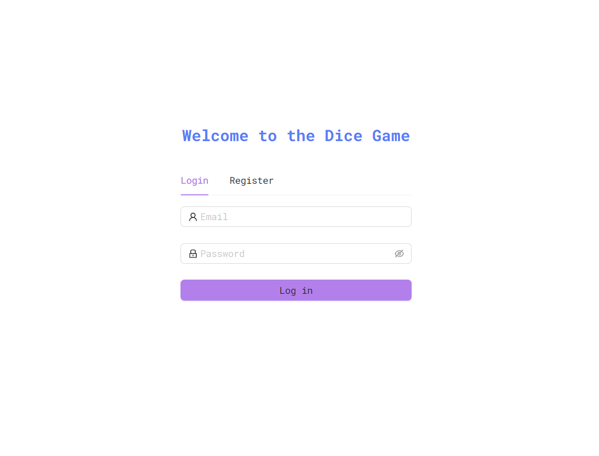
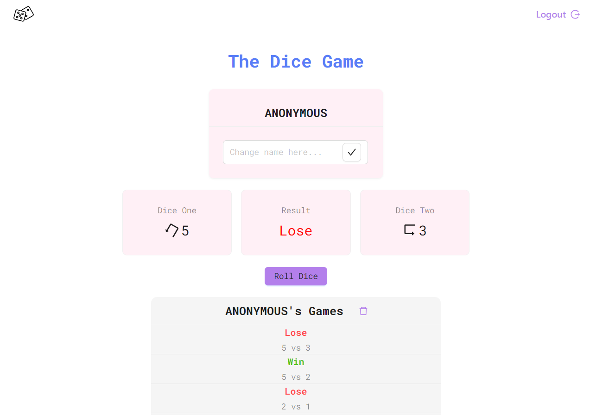

# Dice Game Full-Stack Application

Dice game using clean architecture and a lot of techonologies. You will win the game if you get a 7, any other result will be a lost game. This project integrates both frontend and backend components with two databases (MongoDB and PostgreSQL). The application allows users to register, login, play the dice game, and view various statistics.

## Technologies


## Player Registration and Management

- Players register with a unique name to participate.
- Registration without a name assigns the player as "ANONYMOUS", with multiple such players possible.
- Each player is assigned a unique identifier and registration date.
- Players can delete their roll history but cannot delete specific game entries.

## API Endpoints

- `POST /api/players`: Create a player.
- `PUT /api/players/{id}`: Modify a player's name.
- `GET /api/players`: List all players with their success percentages.
- `POST /api/players/login`: Login a player.
- `POST /api/games/{id}`: Perform a dice roll for a specific player.
- `DELETE /api/games/{id}`: Delete a player's game history.
- `GET /api/games/{id}`: List a player's game history.
- `GET /api/ranking`: Retrieve player rankings by success rate and the average success rate.
- `GET /api/ranking/loser`: Identify the player with the lowest success rate.
- `GET /api/ranking/winner`: Identify the player with the highest success rate.

## Database and Persistence

- Level 1: Uses MySQL with Sequelize ORM.
- Level 2: Creates frontend
- Level 3: Uses MongoDB with Mongoose for database operations.

## Frontend

- A frontend is developed to interact with the backend, providing a user-friendly interface for game interaction and viewing statistics.

## Development and Documentation

- Comprehensive API documentation, including route details, parameters, and expected responses.
- Include API testing using tools like Postman or Insomnia.
- Database schema diagrams and Docker instances for DB management are included.

## Testing and CI

- Includes tests to verify the correct functioning of the application.
- Utilizes Continuous Integration (CI) with GitHub Actions.

## Technologies

- The project is developed using TypeScript to enhance code quality and maintainability.

## Setup and Installation

Detailed instructions are provided for setting up and installing the application, ensuring you can get it running in your local development environment seamlessly.

## Contributions

Contributions are welcome. Ensure any pull requests or issues adhere to the established coding standards and include necessary tests for new features.


docker-compose run app npx prisma generate
docker-compose run app npx prisma migrate dev --name init
docker-compose build --no-cache
docker compose up

### Login page



### Home page



```
/server
|-- /src
|
| |-- /application
| | |-- /dto
| | | |-- player.dto.ts
| | | |-- game.dto.ts
| | | |-- createGame.dto.ts
| | | |-- createPlayer.dto.ts
| | | |-- ranking.dto.ts
| | | |-- updatePlayer.dto.ts
|
| | |-- /services
| | | |-- playerService.ts
| | | |-- gameService.ts
| | | |-- rankingService.ts
|
| |-- /core
| | |-- /domain
| | | |-- /entities
| | | | |-- IGame.ts
| | | | |-- IPlayer.ts
| | | | |-- IRanking.ts
|
| |-- /repositories
| | |-- IGameRepository.ts
| | |-- IPlayerRepository.ts
| | |-- IRankingRepository.ts
|
| |-- /infrastructure
| | |-- /config
| | | |-- mongoConfig.ts
| | | |-- prismaConfig.ts
|
| | |-- /controllers
| | | |-- playerController.ts
| | | |-- gameController.ts
| | | |-- rankingController.ts
|
| | |-- /models
| | | |-- PlayerModel.ts
| | | |-- GameModel.ts
|
| | |-- /repositories
| | | |-- /mongo
| | | | |-- PlayerRepository.ts
| | | | |-- GameRepository.ts
| | | | |-- RankingRepository.ts
| | | |-- /postgres
| | | | |-- PlayerRepository.ts
| | | | |-- GameRepository.ts
| | | | |-- RankingRepository.ts
|
| | |-- /routes
| | | |-- playerRoutes.ts
| | | |-- gameRoutes.ts
| | | |-- rankingRoutes.ts
|
| | |-- /middleware
| | | |-- authMiddleware.ts
|
| | |-- app.ts
|
| |-- index.ts
|
| |-- /tests
| | |-- /application
| | | |-- /services
| | | | |-- playerService.test.ts
| | |-- /infrastructure
| | | |-- /controllers
| | | | |-- playerController.test.ts
|
| |-- /utils
| | |-- getRepository.ts
| | |-- getRandomInt.ts
|
|-- /prisma
| |-- schema.prisma
|
|-- .env
|-- package.json
|-- tsconfig.json
|-- jest.config.json
|-- Dockerfile
|-- docker-compose.yml
|-- .gitignore
```
